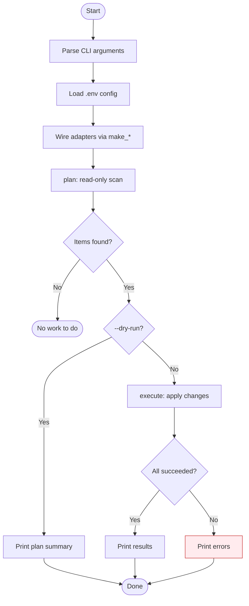
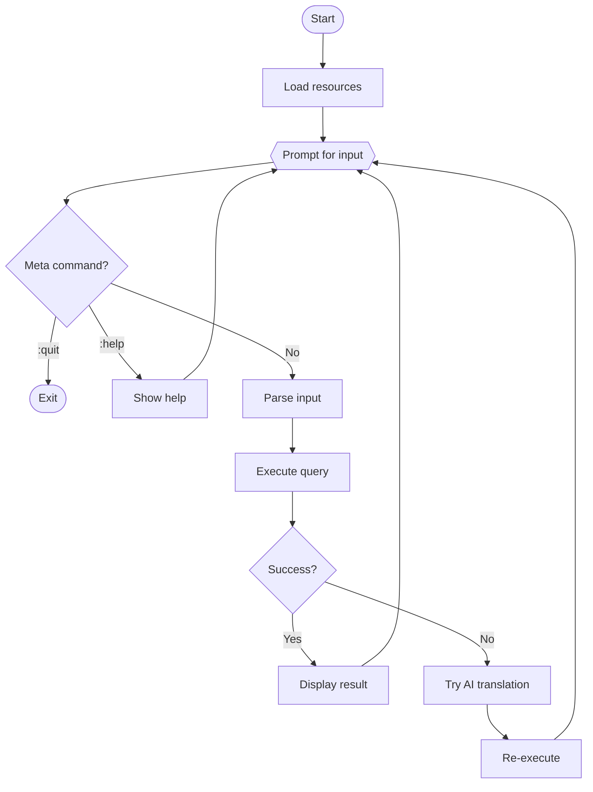
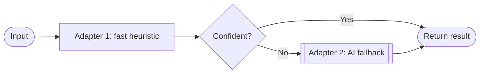

# UX Flow Diagram Skill

## Purpose

This skill generates **Mermaid flowchart** diagrams that visualize user experience flows — screen transitions, decision points, and interaction paths through a CLI tool or application.

## Scope

Use this skill to document:

- CLI tool interaction flows (argument parsing → execution → output)
- Multi-step user workflows (prompts, confirmations, branching)
- REPL loops with command dispatch
- Plan-then-execute patterns (dry-run vs. live)
- Error and fallback paths

## Mermaid Flowchart Conventions

### Direction

Use **TD** (top-down) for linear flows, **LR** (left-right) for branching-heavy flows.

### Node shapes

| Shape | Syntax | Use for |
|-------|--------|---------|
| Rounded | `(text)` | Start / End |
| Rectangle | `[text]` | Action / Step |
| Diamond | `{text}` | Decision / Branch |
| Hexagon | `{{text}}` | Loop / Iteration |
| Stadium | `([text])` | User input |
| Subroutine | `[[text]]` | External system call |

### Styling

Use `classDef` to distinguish layer concerns:

```mermaid
classDef user fill:#e1f5fe,stroke:#0288d1
classDef domain fill:#f3e5f5,stroke:#7b1fa2
classDef adapter fill:#fff3e0,stroke:#ef6c00
classDef error fill:#ffebee,stroke:#c62828
```

### Subgraphs

Group by architectural layer or phase:

```mermaid
subgraph CLI ["__main__.py"]
  ...
end
subgraph Service ["service.py"]
  ...
end
subgraph Adapters ["adapters/"]
  ...
end
```

## Template — CLI Tool Flow



## Template — Interactive REPL Flow



## Template — Chained Adapter Flow



## Workflow

### Generating a UX Flow

1. **Identify the entry point** — `__main__.py` or top-level script.
2. **Trace the service method** — follow `plan()` / `execute()` or `execute()` to map steps.
3. **Mark decision points** — flags (`--dry-run`), user prompts, error branches.
4. **Map adapter calls** — external system interactions (API, filesystem, subprocess).
5. **Render as Mermaid** — use the conventions above.
6. **Write standalone file** — save the raw Mermaid source (without markdown fences) to `<tool>/ux-flow.mmd`.
7. **Embed in README** — add a `## UX Flow` section in the tool's `README.md` wrapping the same diagram in a ` ```mermaid ` code block.

### Output files

Each tool gets two outputs kept in sync:

| File | Content | Purpose |
|------|---------|---------|
| `<tool>/ux-flow.mmd` | Raw Mermaid source (no fences) | Standalone rendering, CI, editors |
| `<tool>/README.md` § UX Flow | Same diagram inside ` ```mermaid ` block | GitHub / VS Code preview |

When creating or updating a diagram, always write **both** files.

### Updating a UX Flow

1. **Read the existing diagram** from `ux-flow.mmd` (or `README.md` if `.mmd` is missing).
2. **Diff against current code** — check for new branches, removed steps, renamed phases.
3. **Update nodes and edges** — keep IDs stable when possible.
4. **Write both** `ux-flow.mmd` and the `## UX Flow` section in `README.md`.
5. **Verify** — paste into a Mermaid live editor or preview in VS Code.

## Quality Checks

Before finalizing a diagram:

- [ ] Every user-visible action has a node
- [ ] All decision branches have labels (Yes/No or condition)
- [ ] Error paths are shown and styled with `:::error`
- [ ] Loops are represented with hexagon nodes or back-edges
- [ ] Subgraphs match architectural layers when relevant
- [ ] Diagram renders without syntax errors

## Command Examples

```
# Generate UX flow for a tool
"Create a UX flow diagram for rename-papers"

# Add flow to existing README
"Add a UX Flow section to query-prolog/README.md"

# Update after code changes
"Update the UX flow diagram in extract-from-chrome-to-supabase/README.md"

# Diagram a specific interaction
"Draw the REPL loop flow for query-prolog"
```
