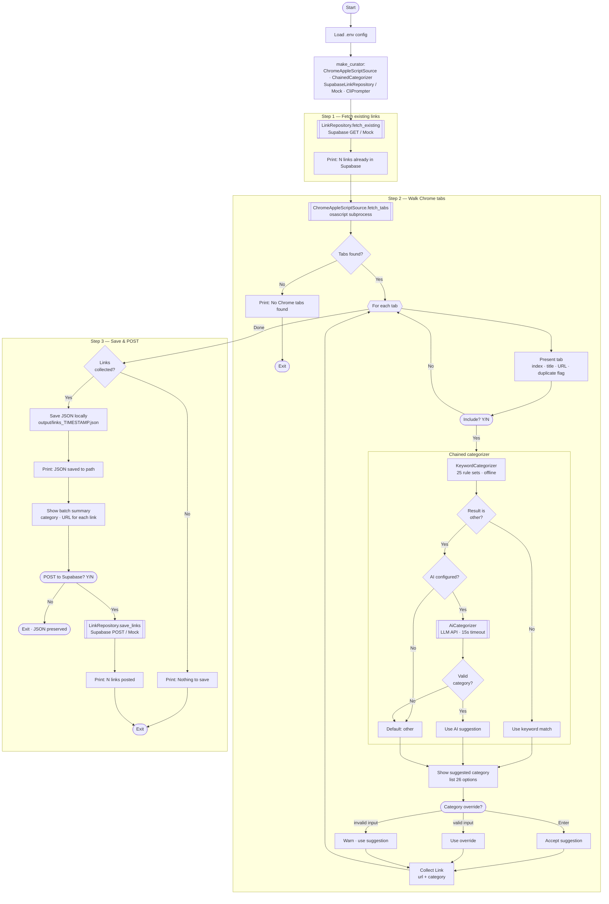

# extract-from-chrome-to-supabase

Interactive CLI to curate open Chrome tabs, categorize them (keyword heuristic + AI fallback), and save to Supabase.

## Setup

```bash
cd extract-from-chrome-to-supabase

# Create venv + install deps
make setup

# Edit .env with your Supabase keys (or keep MOCK=true for testing)
$EDITOR .env
```

## Usage

```bash
make run          # Full run: curate tabs, save JSON, POST to Supabase
make dry-run      # Preview: curate tabs, print JSON to stdout, skip writes
```

The interactive workflow:

1. Fetches existing links from Supabase (to flag duplicates)
2. Walks through each open Chrome tab — asks Y/N, suggests a category
3. Saves collected links as local JSON, then optionally POSTs to Supabase

## Files

```
extract-from-chrome-to-supabase/
├── .env.example              # Template — copy to .env
├── Makefile                  # setup / run / clean targets
├── requirements.txt
├── ux-flow.mmd               # UX flow diagram (Mermaid)
└── chrome_to_supabase/       # Python package
    ├── __init__.py
    ├── __main__.py           # CLI entry point
    ├── domain.py             # Tab, Link, CATEGORIES
    ├── ports.py              # TabSource, LinkRepository, CategorySuggester, UserPrompter
    ├── service.py            # CurateTabsUseCase + make_curator() factory
    └── adapters/
        ├── __init__.py
        ├── tab_source.py     # ChromeAppleScriptSource (osascript)
        ├── categorizer.py    # KeywordCategorizer, AiCategorizer, ChainedCategorizer
        ├── repository.py     # SupabaseLinkRepository, MockLinkRepository
        └── prompter.py       # CliPrompter
```

## Protocols

### TabSource

```python
class TabSource(Protocol):
    def fetch_tabs(self) -> list[Tab]: ...
```

### LinkRepository

```python
class LinkRepository(Protocol):
    def fetch_existing(self) -> list[dict]: ...
    def save_links(self, links: list[Link]) -> None: ...
```

### CategorySuggester

```python
class CategorySuggester(Protocol):
    def suggest(self, tab: Tab) -> str: ...
```

### UserPrompter

```python
class UserPrompter(Protocol):
    def show_existing(self, links: list[dict]) -> None: ...
    def present_tab(self, tab: Tab, index: int, total: int, already_saved: bool) -> None: ...
    def ask_include(self) -> bool: ...
    def ask_category(self, suggestion: str) -> str: ...
    def confirm_batch(self, links: list[Link]) -> bool: ...
    def report_saved_json(self, path: Path) -> None: ...
    def report_posted(self, count: int) -> None: ...
    def report_skip(self) -> None: ...
```

## Types

### Tab

- `title: str` — Page title
- `url: str` — Page URL

### Link

- `url: str` — Categorized URL
- `category: str` — One of 26 predefined categories

## Implementations

| Adapter | Protocol | Description |
|---------|----------|-------------|
| `ChromeAppleScriptSource` | `TabSource` | Reads Chrome tabs via macOS osascript |
| `KeywordCategorizer` | `CategorySuggester` | Offline keyword matching (25 rule sets) |
| `AiCategorizer` | `CategorySuggester` | OpenAI / Anthropic API fallback |
| `ChainedCategorizer` | `CategorySuggester` | Keyword first, AI fallback if "other" |
| `SupabaseLinkRepository` | `LinkRepository` | HTTP calls to Supabase edge functions |
| `MockLinkRepository` | `LinkRepository` | Fake implementation for local testing |
| `CliPrompter` | `UserPrompter` | Terminal-based interactive prompts |

## UX Flow



## Dependencies

- `httpx` — HTTP client for Supabase and LLM API calls
- `python-dotenv` — `.env` file loading
