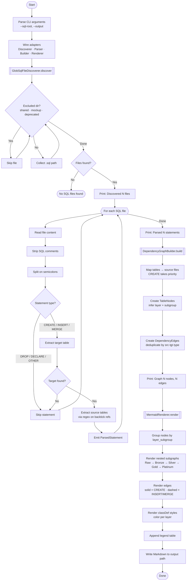

# generate_data_diagram

Scan SQL files for BigQuery table references and render a Mermaid dependency diagram showing the full data pipeline architecture.

```
*.sql files  →  parse dependencies  →  diagram_tables.md (Mermaid)
```

## Setup

```bash
cd generate_data_diagram

# Create venv + install deps
make setup
```

## Usage

```bash
# Default paths (sql-root and output configured in script)
make run

# Preview: print Mermaid to stdout without writing the output file
make dry-run

# Custom paths
python generate_data_diagram/generate.py --sql-root /path/to/sql --output diagram.md
python generate_data_diagram/generate.py --sql-root /path/to/sql --dry-run
```

## UX Flow



### Phase summary

| Phase | Adapter | Input | Output |
|-------|---------|-------|--------|
| Discovery | `GlobSqlFileDiscoverer` | `sql_root` directory | Sorted `list[Path]` |
| Parsing | `RegexSqlParser` | SQL file content | `list[ParsedStatement]` |
| Graph building | `DependencyGraphBuilder` | Parsed statements | `DependencyGraph` (nodes + edges) |
| Rendering | `MermaidRenderer` | Dependency graph | Markdown string with Mermaid diagram |
