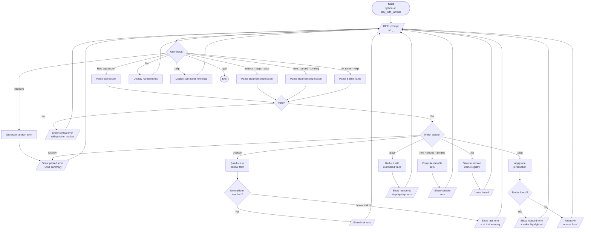

# PRD — play-with-lambda-expressions

## 1. Problem statement

Learning untyped lambda calculus is hard without hands-on practice. Textbooks show final results but hide the mechanical reduction steps. There is no lightweight CLI tool that lets you:

- Write lambda expressions and watch them reduce step-by-step.
- Inspect structural properties (free/bound variables, normal form status).
- Generate random expressions to explore the space beyond Church numerals and standard combinators.

## 2. Target user

A single user (the author) learning lambda calculus. The tool is a study companion, not a production system.

## 3. Goals

| # | Goal | Success metric |
|---|------|----------------|
| G1 | Parse and display lambda expressions faithfully | Round-trip: `parse(stringify(t)) == t` for all valid terms |
| G2 | Step-by-step β-reduction with full trace | User can follow each substitution as it happens |
| G3 | Detect normal forms and divergence | Tool reports when a term is in normal form or when a reduction limit is hit |
| G4 | Inspect variable status | Free, bound, and binding variables listed on demand |
| G5 | Random expression generation | Produce well-formed terms of configurable depth/size |
| G6 | Named expressions library | Alias terms (`let S = λx.λy.λz.x z (y z)`) and reuse them |

## 4. Non-goals

- Type inference / typed lambda calculi (System F, simply-typed, etc.).
- GUI or web interface.
- Performance benchmarks or large-scale computation.
- Persistent storage across sessions (names live in-memory for the session).

## 5. Functional requirements

### 5.1 Expression syntax

The tool adopts a **strict, explicit** syntax — no syntactic sugar:

| Construct | Syntax | Example |
|-----------|--------|---------|
| Variable | single letter or identifier | `x`, `foo` |
| Abstraction | `λ<var>.<body>` or `\<var>.<body>` | `λx.x`, `\x.x` |
| Application | `(<func> <arg>)` | `(λx.x y)` |

- Each `λ` binds exactly **one** variable (no `λxy.` shorthand).
- Application requires explicit parentheses (no left-associativity convention).
- `λ` and `\` are interchangeable for input; output uses `λ`.

### 5.2 REPL commands

| Command | Description |
|---------|-------------|
| `<expr>` | Parse and display the expression tree |
| `:reduce <expr>` | Fully β-reduce (up to a configurable step limit) |
| `:step <expr>` | Perform one β-reduction step, show result |
| `:trace <expr>` | Show full reduction trace (each step numbered) |
| `:free <expr>` | List free variables |
| `:bound <expr>` | List bound variables |
| `:binding <expr>` | List binding variables (those after λ) |
| `:random [depth]` | Generate a random well-formed term (default depth: 3) |
| `:let <name> = <expr>` | Bind a name to an expression for the session |
| `:list` | Show all named expressions |
| `:help` | Show available commands |
| `:quit` | Exit the REPL |

### 5.3 Reduction behaviour

- **Strategy**: normal-order (leftmost-outermost redex first) — guarantees finding the normal form if one exists.
- **Step limit**: configurable via `--max-steps` CLI flag (default: 100). When hit, the tool prints the last term and a warning.
- **α-conversion**: performed automatically to avoid variable capture during substitution.
- **η-reduction**: not applied by default; could be a future extension.

### 5.4 Random generation

- Generates syntactically valid, closed terms (no free variables) by default.
- `depth` parameter controls AST depth (not string length).
- Distribution: configurable bias between variable / abstraction / application nodes.

## 6. UX / UI flow



### Flow description

1. **Start** — user launches the CLI. Optional flags: `--max-steps`, `--random-depth`.
2. **REPL prompt** (`λ> `) — waits for input.
3. **Dispatch** — input is classified as a raw expression or a `:command`.
4. **Parse** — the expression (whether standalone or command argument) is parsed. On failure, a syntax error with position marker is shown.
5. **Action** — depending on the command, the tool reduces, inspects, or stores the term.
6. **Output** — results are printed and the REPL loops back.
7. **Exit** — `:quit` or `Ctrl-D` ends the session.

## 7. CLI interface

```
usage: python -m play_with_lambda [-h] [--max-steps N] [--random-depth D]

Interactive untyped lambda calculus REPL.

options:
  -h, --help         show this help message and exit
  --max-steps N      Maximum β-reduction steps before stopping (default: 100)
  --random-depth D   Default AST depth for :random (default: 3)
```

## 8. Open questions

| # | Question | Options | Leaning |
|---|----------|---------|---------|
| Q1 | Language choice | Python (repo consistency), Rust (ADT + perf), Clojure (natural fit) | Python — keeps monorepo uniform; ADT via `@dataclass` + match |
| Q2 | Persistent name registry | In-memory only vs. JSON file | In-memory first; file persistence as future extension |
| Q3 | De Bruijn indices | Use internally for substitution? | Yes for correctness; display in named form |
| Q4 | Multi-step `:step` | Allow `:step 5 <expr>`? | Nice-to-have, not MVP |
| Q5 | Import standard library | Preload combinators (S, K, I, Y, Church numerals)? | Yes — ship a built-in set loaded at startup |
