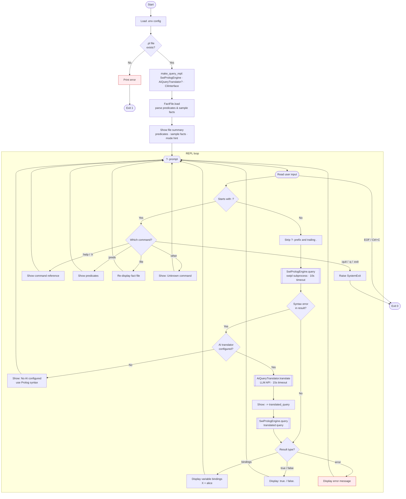

# query-prolog

Interactive REPL for querying Prolog fact files. Supports direct Prolog syntax and natural language (translated to Prolog via AI).

Requires SWI-Prolog: `brew install swi-prolog`

## Setup

```bash
cd query-prolog

# Create venv + install deps
make setup

# Edit .env with AI keys (optional — Prolog-only mode works without)
$EDITOR .env
```

## Usage

```bash
# Query the included example file
make run FILE=.data/family.pl

# Query any .pl file
make run FILE=/path/to/facts.pl
```

### REPL examples

```
?- parent(X, bob)
X = alice

?- Who is bob's parent?
   -> parent(X, bob)
X = alice

?- :preds
Predicates: ancestor/2, father/2, female/1, grandparent/2, male/1, mother/2, parent/2, sibling/2

?- :quit
```

## Files

```
query-prolog/
├── .env.example              # Template — copy to .env
├── Makefile                  # setup / run / clean targets
├── requirements.txt
├── family.pl                 # Example Prolog fact file
├── ux-flow.mmd               # UX flow diagram (Mermaid)
└── query_prolog/             # Python package
    ├── __init__.py
    ├── __main__.py           # CLI entry point (argparse)
    ├── domain.py             # FactFile, QueryResult, InputMode
    ├── ports.py              # PrologEngine, QueryTranslator, UserInterface
    ├── service.py            # QueryFactsUseCase + make_query_repl() factory
    └── adapters/
        ├── __init__.py
        ├── prolog_engine.py  # SwiPrologEngine (subprocess)
        ├── query_translator.py # AiQueryTranslator (OpenAI / Anthropic)
        └── cli_interface.py  # CliInterface (terminal REPL)
```

## Protocols

### PrologEngine

```python
class PrologEngine(Protocol):
    def query(self, fact_file: FactFile, prolog_query: str) -> QueryResult: ...
```

### QueryTranslator

```python
class QueryTranslator(Protocol):
    def translate(self, natural_query: str, fact_file: FactFile) -> str: ...
```

### UserInterface

```python
class UserInterface(Protocol):
    def show_fact_file(self, fact_file: FactFile) -> None: ...
    def read_input(self) -> str | None: ...
    def show_translation(self, prolog_query: str) -> None: ...
    def show_result(self, result: QueryResult) -> None: ...
    def show_message(self, msg: str) -> None: ...
```

## Types

### FactFile

- `path: Path` — Path to the `.pl` file
- `content: str` — Full file content
- `predicates: list[str]` — Extracted signatures (e.g. `["parent/2", "male/1"]`)

### QueryResult

- `query: str` — The executed query
- `success: bool` — Whether the query succeeded
- `bindings: list[dict[str, str]]` — Variable bindings from solutions
- `error: str` — Error message if any

## Implementations

| Adapter | Protocol | Description |
|---------|----------|-------------|
| `SwiPrologEngine` | `PrologEngine` | Executes queries via `swipl` subprocess |
| `AiQueryTranslator` | `QueryTranslator` | Natural language to Prolog via OpenAI / Anthropic |
| `CliInterface` | `UserInterface` | Terminal-based REPL with `?-` prompt |

## UX Flow



## Dependencies

- `httpx` — HTTP client for LLM API calls (lazy-loaded)
- `python-dotenv` — `.env` file loading
- **System:** `swipl` (SWI-Prolog) must be on PATH
