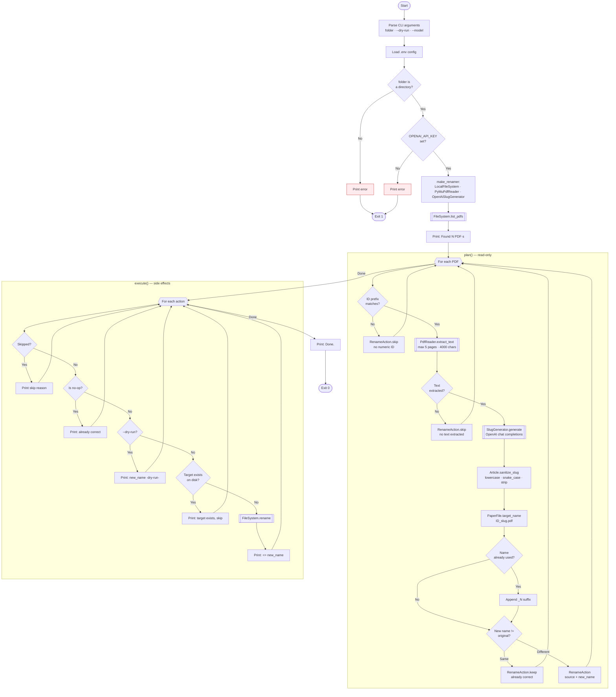

# rename-papers

Rename research paper PDFs based on their content using OpenAI.

```
2510.12269v3.pdf  →  2510.12269v3_tensor_logic_for_ai.pdf
0310054.pdf       →  0310054_kleene_algebra_domain.pdf
```

## Setup

```bash
cd rename-papers

# Create venv + install deps
make setup

# Add your API key
$EDITOR .env
```

## Usage

```bash
# Preview (recommended first)
make dry-run FOLDER=~/Downloads/papers

# Apply renames
make run FOLDER=~/Downloads/papers
```

### Global access (optional)

```bash
# Symlink the wrapper into your PATH
ln -s ~/tools/rename-papers/rename-papers.sh ~/.local/bin/rename-papers

# Then from anywhere:
rename-papers ~/Downloads/papers --dry-run
rename-papers ~/Downloads/papers
rename-papers ~/Downloads/papers --model gpt-4o
```

## Files

```
rename-papers/
├── .env.example              # Template — copy to .env
├── Makefile                  # setup / run / dry-run / clean targets
├── requirements.txt
├── rename-papers.sh          # Shell wrapper for global PATH access
└── rename_papers/            # Python package
    ├── __init__.py
    ├── __main__.py           # CLI entry point (argparse)
    ├── domain.py             # IdPrefix, Article, PaperFile, RenameAction
    ├── ports.py              # FileSystem, PdfReader, SlugGenerator
    ├── service.py            # PaperRenamer + make_renamer() factory
    └── adapters/
        ├── __init__.py
        ├── filesystem.py     # LocalFileSystem
        ├── pdf_reader.py     # PyMuPdfReader
        └── slug_generator.py # OpenAiSlugGenerator
```

## Protocols

### FileSystem

```python
class FileSystem(Protocol):
    def list_pdfs(self, folder: Path) -> list[Path]: ...
    def rename(self, source: Path, target: Path) -> None: ...
    def exists(self, path: Path) -> bool: ...
```

### PdfReader

```python
class PdfReader(Protocol):
    def extract_text(self, path: Path) -> str: ...
```

### SlugGenerator

```python
class SlugGenerator(Protocol):
    def generate(self, text: str) -> str: ...
```

## Types

### IdPrefix

- `value: str` — Numeric identifier (e.g. `"2510.12269v3"`)
- `separator: str` — Separator character (`"_"`)

### Article

- `slug: str` — Semantic slug (e.g. `"tensor_logic_for_ai"`)

### PaperFile

- `path: Path` — PDF file path
- `id_prefix: IdPrefix` — Parsed numeric ID

### RenameAction

- `source: Path` — Original file path
- `new_name: str` — Target filename
- `skipped: bool` — Whether this file is skipped
- `reason: str` — Reason for skip/keep

## Implementations

| Adapter | Protocol | Description |
|---------|----------|-------------|
| `LocalFileSystem` | `FileSystem` | Real filesystem operations |
| `PyMuPdfReader` | `PdfReader` | Text extraction via PyMuPDF (first N pages) |
| `OpenAiSlugGenerator` | `SlugGenerator` | Slug generation via OpenAI chat completions |

## UX Flow



## Dependencies

- `openai` — OpenAI Python SDK
- `pymupdf` — PDF text extraction
- `python-dotenv` — `.env` file loading
